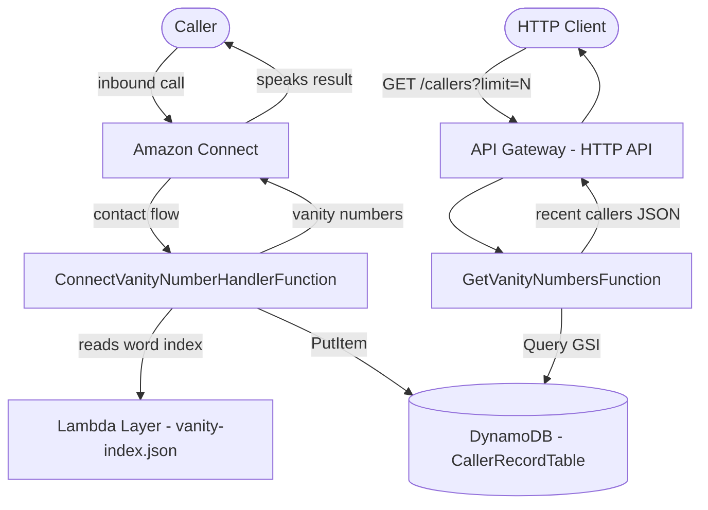

# Design Notes

## Architecture Diagram

**DynamoDB table layout:**

| Key | Type | Purpose |
|---|---|---|
| `phoneNumber` | Partition key | Look up a specific caller's records |
| `createdAt` | Sort key | Most recent record first within a caller |
| `recordType` | GSI partition key | Fan-out query for all recent callers |

---

## 1. Implementation Decisions

### Vanity Conversion

**Pre-built word index.**
Every word maps to the same phone keypad digits every time — that never changes. So instead of recalculating it on every call, I build the lookup table once ahead of time. Looking up a phone number's digits then becomes a direct map lookup rather than scanning through the entire word list.

**Word index as a Lambda Layer.**
The index file is large. Packing it into every deployment would slow things down and add unnecessary bulk. As a Lambda Layer, it lives separately, gets uploaded once, and is shared across functions — without adding cost or pulling in extra services.

**`popular-english-words` as the word source.**
Vanity numbers are meant to be memorable — they work best when the result is a word people already know. This library ranks words by how commonly they appear in everyday English, so the suggestions lean toward recognisable words rather than obscure ones.

### Infrastructure

**Inversify for dependency injection.**
Having a DI container means each piece of the application only knows about the interfaces it depends on, not the concrete implementations. This made writing tests much easier — swap the real database client for a mock and the logic can be tested in isolation.

**Bun as the package manager and test runner.**
It's noticeably faster than npm for both installing packages and running tests, which made the development loop quicker without any changes to the code itself.

**AWS SAM for infrastructure.**
SAM is AWS's own tool for deploying serverless applications. It has built-in support for everything this project uses — Lambda, API Gateway, DynamoDB, Lambda Layers, and Amazon Connect — and handles a lot of the CloudFormation boilerplate automatically.

### Bottlenecks Encountered

**Amazon Connect phone number quota.**
By default, AWS sets the phone number limit for a new Connect instance to zero. Without a claimed number, there's no way to test an actual inbound call end-to-end. A quota increase has been requested, but approval can take several days. In the meantime, the Lambda can be invoked directly using the sample event in `events/connect.json`.

---

## 2. Shortcuts Taken (Bad Practice in Production)

**No authentication layer.**
The `GET /callers` API is currently public — any client with the endpoint URL can retrieve caller records. In production this is unacceptable; the endpoint should be protected by an auth layer restricting access to authorised consumers only.

---

## 3. Wishlist (Given More Time)

**Authentication and user management.**
Depending on requirements, integrate AWS Cognito to handle auth and user management. The API Gateway authorizer would validate tokens before requests reach the Lambda, keeping auth concerns out of application code.

**Revisit the DynamoDB schema.**
The current schema is designed around the known access patterns — look up by phone number and list recent callers. With more context on future features (e.g., per-user history, analytics, multi-tenant support), the schema and GSI design would likely need to evolve.

**Shared API contract library.**
For a project with both a backend and a frontend consumer, a shared TypeScript library defining request/response types would prevent drift between the two sides and catch contract mismatches at compile time rather than at runtime.

**Nested SAM templates.**
For a larger project, splitting the monolithic `template.yaml` into nested stacks (e.g., data layer, compute layer, Connect resources) improves maintainability and allows teams to deploy independently.

**Build a custom word index library.**
The project currently depends on `popular-english-words`, which has not been updated in over five years. No actively maintained frequency-ranked English word library was available as a drop-in replacement. Given more time, building and publishing a dedicated library — sourced from a current corpus such as Google Books Ngrams would give control over word selection, frequency weighting, and could be reused across projects.

---

## 4. Production Readiness Considerations

**Provisioned concurrency for the Connect Lambda.**
Cold starts on `ConnectVanityNumberHandlerFunction` are caller-facing — the caller hears silence while the runtime initialises. Setting `ProvisionedConcurrentExecutions: 1` on the function eliminates cold starts entirely. This was intentionally left out to avoid ongoing cost during development, but should be enabled before production traffic.

**Restrict API access by origin and identity.**
The `GET /callers` endpoint currently has no access controls. Before exposing it beyond internal use, it should be locked down in two ways: allowed origins should be enforced at the WAF level — attaching an AWS WAF web ACL to the API Gateway allows origin-based rules to be configured and updated independently of the application code, without redeploying the stack. Additionally, an authentication layer (e.g., a Cognito JWT authorizer on the API Gateway) should ensure only authenticated users can retrieve caller records. The Connect Lambda itself is already restricted — it can only be invoked by the linked Amazon Connect instance via the `ConnectLambdaPermission` resource.
